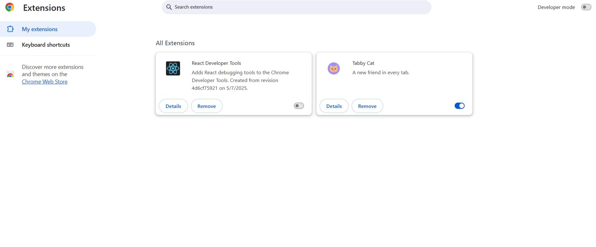

#  Suspicious Browser Extensions Audit Report

##  Browser Used:
Google Chrome

##  Opened  browser’s extensions:
Chrome: chrome://extensions/

##  Screenshot:

## Installed Extensions Reviewed:
| Extension Name       | Publisher        | Purpose                        | Permissions         | Status     |
|----------------------|------------------|--------------------------------|----------------------|------------|
| React Developer Tools| Facebook (Meta)  | React development debugging    | DevTools access only |  Kept     |
| Tabby Cat            | Unknown          | Virtual pet in new tabs        | Read browser tabs    |  Removed  |

##  Removed Extensions:
1. **Tabby Cat**
   - **Reason:** Entertainment-only purpose, not essential. Slightly impacts performance with animations. Unclear publisher trust. Removed for better focus and security.

##  What I Learned:
- Browser extensions can:
  - Access and modify site data
  - Slow down browser performance
  - Pose a privacy risk if permissions are abused
- Always check the source, purpose, and permissions.
- Regularly auditing extensions reduces security risks.

## 📈 Post-Removal Observation:
- Cleaner, faster browser startup.
- Reduced distractions on new tab pages.
